# StoreFlow — Product Management Dashboard

A premium, dark-and-emerald product-management dashboard built on top of the free
[DummyJSON](https://dummyjson.com) catalogue. It implements the full product-admin
assignment (auth, protected routes, product listing, search, filtering, sorting,
pagination, details, and add/edit/delete) and layers a real, data-driven analytics
dashboard on top of it.

| | |
| --- | --- |
| **Live demo** | https://react-dashboard-nextgenesis.vercel.app |
| **Repository** | https://github.com/KaranDarade/React-Dashboard-NextGenesis- |
| **Admin login** | `daradekaran123@gmail.com` / `KaranStore@123` |
| **Stack** | Next.js 16 · React 19 · TypeScript · Tailwind CSS v4 · Axios |
| **API** | DummyJSON (no API key required) |

> Product data, images and reviews come from DummyJSON. Add/edit/delete are
> simulated locally (the API does not persist writes) and prices are displayed in
> INR using a fixed demo conversion. These are demonstration values, not real
> market data.

---

## Table of contents

1. [Overview](#overview)
2. [Feature checklist](#feature-checklist)
3. [Tools & technology used](#tools--technology-used)
4. [Installation & setup](#installation--setup)
5. [Environment variables](#environment-variables)
6. [Available scripts](#available-scripts)
7. [System design](#system-design)
8. [Architecture diagrams](#architecture-diagrams)
9. [Request lifecycle & edge cases](#request-lifecycle--edge-cases)
10. [State management](#state-management)
11. [Routing & route protection](#routing--route-protection)
12. [API integration](#api-integration)
13. [URL contract](#url-contract)
14. [Design system](#design-system)
15. [Responsive UI](#responsive-ui)
16. [Project structure](#project-structure)
17. [How it was built — step by step](#how-it-was-built--step-by-step)
18. [Decisions & trade-offs](#decisions--trade-offs)
19. [Performance](#performance)
20. [Accessibility](#accessibility)
21. [Security notes](#security-notes)
22. [Verification & testing](#verification--testing)
23. [Deployment](#deployment)
24. [Troubleshooting](#troubleshooting)
25. [Known limitations](#known-limitations)
26. [Credits](#credits)

---

## Overview

**StoreFlow** is a single-admin dashboard that talks to the DummyJSON REST API to
manage a catalogue of 194 real products across 24 categories. It is deliberately
built **without** any data-fetching, table, pagination, or chart library — every
piece of behaviour and every visual is hand-written so the source is fully
auditable.

Two things make it more than a basic CRUD screen:

1. **A real analytics dashboard.** KPIs and charts are computed from the live
   catalogue (catalogue size, inventory value, average rating, stock health,
   category mix, price distribution, brands). Nothing is hard-coded.
2. **A polished, themeable UI.** A token-based dark/emerald glass design system
   with a light mode, responsive layouts (desktop table → mobile cards → mobile
   bottom navigation), and built-in loading, empty and error states.

---

## Feature checklist

### Assignment requirements

| Requirement | Status | Where |
| --- | --- | --- |
| Login (`POST /auth/login`) | ✅ | `src/lib/api/auth.ts`, `src/app/login/page.tsx` |
| Errors for wrong credentials | ✅ | `src/lib/api/client.ts` → inline alert |
| Only logged-in users can open product pages | ✅ | `src/proxy.ts` (server guard) |
| Logout | ✅ | `src/components/shell/Sidebar.tsx`, `UserMenu`, drawer |
| Product list with image/title/category/price/rating/stock | ✅ | `src/components/products/ProductTable.tsx`, `ProductCard.tsx` |
| Table on desktop | ✅ | `ProductTable.tsx` (`md:` and up) |
| Cards on mobile | ✅ | `ProductGrid.tsx` / `ProductCard.tsx` |
| Pagination via `limit` + `skip` | ✅ | `src/hooks/useProducts.ts`, `src/lib/api/products.ts` |
| Page numbers + Previous/Next | ✅ | `src/components/products/Pagination.tsx` |
| Page size 10 / 20 / 50 | ✅ | `src/lib/constants.ts` |
| "Showing X–Y of Z" | ✅ | `rangeText()` in `src/lib/format.ts` |
| Search (`/products/search?q=`) | ✅ | `src/lib/api/products.ts` |
| Debounced search | ✅ | `src/hooks/useDebounce.ts` |
| Reset to page 1 on search change | ✅ | `ProductsBrowser.handleSearch` |
| Category filter (`/products/categories`) | ✅ | `src/lib/api/products.ts`, `ProductToolbar.tsx` |
| Sort by price / rating / title | ✅ | `SORT_OPTIONS`, `sortBy`/`order` params |
| Details page `/products/[id]` | ✅ | `src/app/(dashboard)/products/[id]/page.tsx` |
| Details show images, description, price, reviews | ✅ | `src/components/products/ProductDetail.tsx`, `ImageGallery`, `ReviewList` |
| Not-found page for a wrong id | ✅ | `src/components/ui/NotFoundState.tsx` |
| Add / edit form with validation | ✅ | `src/components/products/ProductForm.tsx` |
| Delete with confirm popup | ✅ | `src/components/ui/ConfirmDialog.tsx` |
| Loading / empty / error + Retry | ✅ | `src/components/ui/{Spinner,EmptyState,ErrorState}.tsx` |
| One shared Axios setup | ✅ | `src/lib/api/client.ts` |
| Token attached to requests | ✅ | request interceptor |
| Centralised error handling | ✅ | response interceptor |
| Page/search/filter/sort in the URL | ✅ | `src/lib/search-params.ts` |
| No React Query / SWR / table libs | ✅ | deps in `package.json` |
| API calls separated from UI | ✅ | everything under `src/lib/api/` |
| Stale search requests never overwrite newer ones | ✅ | `useProducts` abort + request-id |
| Search vs category limitation handled | ✅ | search wins, documented |
| Add/edit/delete limitation explained | ✅ | README + Settings + inline copy |
| Invalid URL values handled | ✅ | `parseListQuery` |
| Duplicate Save/Login requests prevented | ✅ | in-flight ref guards |

### Extra (beyond the brief)

- Real analytics dashboard (`/`, `/analytics`) computed from the catalogue.
- Categories workspace (`/categories`) and profile (`/profile`).
- Light/dark theme with persistence and no flash-of-wrong-theme.
- Live activity log, connection/latency status, auto-refresh polling.
- Responsive mobile bottom navigation and slide-in drawer.
- Session-scoped KPI deltas and configurable low-stock threshold.

---

## Tools & technology used

### Runtime & framework

| Tool | Version | Why |
| --- | --- | --- |
| **Next.js** | 16.3.6 (App Router, Turbopack) | Routing, server components, `proxy` route guard, build tooling |
| **React** | 19.2.8 | UI, hooks, `useSyncExternalStore` for external state |
| **TypeScript** | ^5 | End-to-end type safety |
| **Tailwind CSS** | v4 (`@tailwindcss/postcss` ^4) | Utility styling driven by custom design tokens |
| **Axios** | ^1.20.0 | All HTTP; single instance + interceptors |
| **next/font** | (built-in) | Self-hosted Inter, zero layout shift |

### Tooling

| Tool | Version | Why |
| --- | --- | --- |
| **ESLint** | ^9 + `eslint-config-next` | Linting (`npm run lint`) |
| **TSC** | ^5 | Type checking (`npm run typecheck`) |
| **Node.js** | 24.x (dev machine) | Runtime for Next.js |
| **Vercel CLI** | 60.x | Production deploys |

### Deliberately **not** used

No React Query, SWR, Redux, Zustand, MobX, TanStack Table, AG Grid, Chart.js,
Recharts, or D3. All fetching, caching, pagination, tables and charts are written
by hand to keep the bundle small and the logic transparent.

### Backend

The **DummyJSON** REST API is the only backend — there is no database. It provides
auth, products, categories, search, sorting and paginated list endpoints, plus
simulated write endpoints.

---

## Installation & setup

### Prerequisites

- **Node.js 18.18+** (developed on Node 24) and npm
- Git
- A modern browser

### Steps

```bash
# 1. Clone
git clone https://github.com/KaranDarade/React-Dashboard-NextGenesis-.git
cd React-Dashboard-NextGenesis-

# 2. Install dependencies
npm install

# 3. (Optional) configure the API base URL — works without this
cp .env.example .env.local

# 4. Start the dev server
npm run dev
# → http://localhost:3000
```

Log in at `/login` with `daradekaran123@gmail.com` / `KaranStore@123`.

### Production build (local)

```bash
npm run build
npm run start
# → http://localhost:3000
```

> The app has **no required configuration** — it defaults to
> `https://dummyjson.com`.

---

## Environment variables

| Name | Required | Default | Description |
| --- | --- | --- | --- |
| `NEXT_PUBLIC_API_BASE_URL` | No | `https://dummyjson.com` | Base URL for all Axios requests |

`.env.example` is committed; real `.env*` files are git-ignored. No secrets are
required or stored (DummyJSON needs no API key).

---

## Available scripts

```bash
npm run dev        # start dev server (Turbopack)
npm run build      # production build
npm run start      # serve the production build
npm run lint       # eslint
npm run typecheck  # tsc --noEmit
```

---

## System design

StoreFlow is a **client-rendered data application inside a server-guarded shell**:

- **Server** renders the app shell and enforces auth in `src/proxy.ts`. It does
  **not** fetch product data — that keeps the API decoupled from render timing
  and lets the client own caching, cancellation and local overrides.
- **Client** owns all product state: URL-driven list queries, a bulk catalogue
  snapshot for analytics, and a `localStorage` overrides store for mutations.
- **One data layer** (`src/lib/api/*`) sits between the UI and Axios. UI
  components never import Axios directly.

### Data flow at a glance

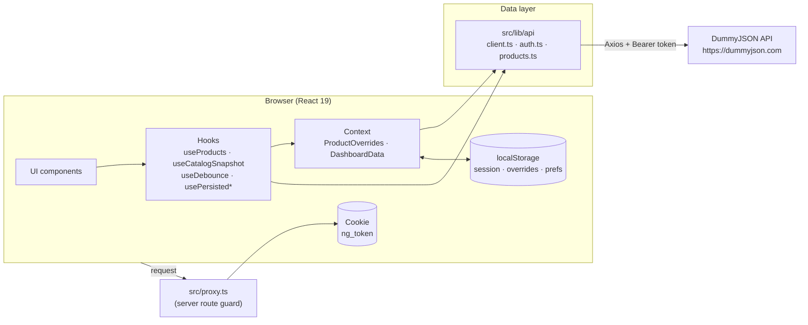

---

## Architecture diagrams

### High-level architecture

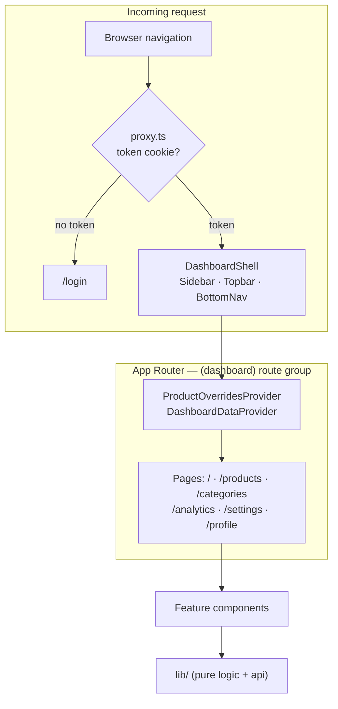

### Component composition

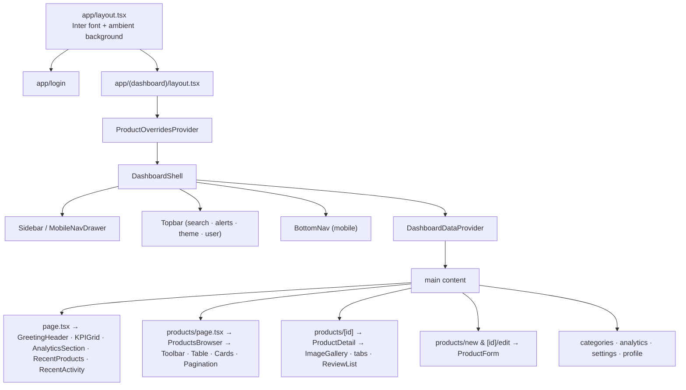

### Request lifecycle (product list)

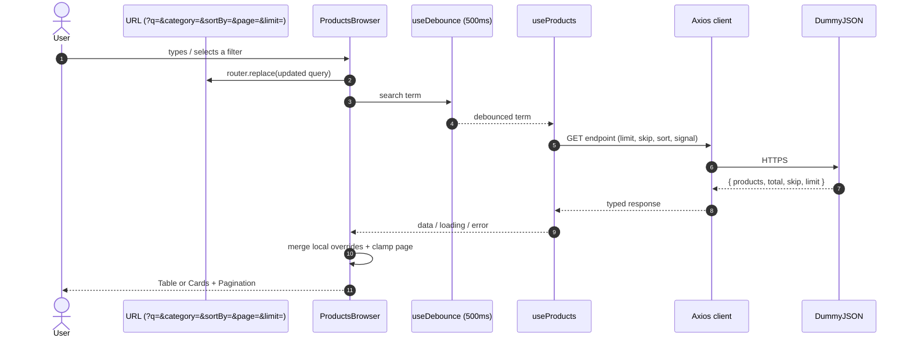

### Stale-search protection (the race condition fix)

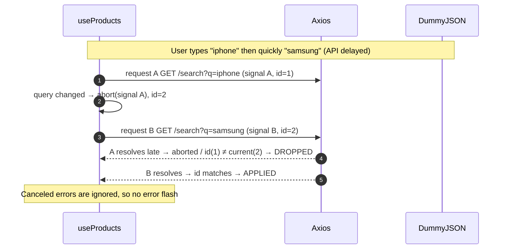

### Local mutations / overrides merge

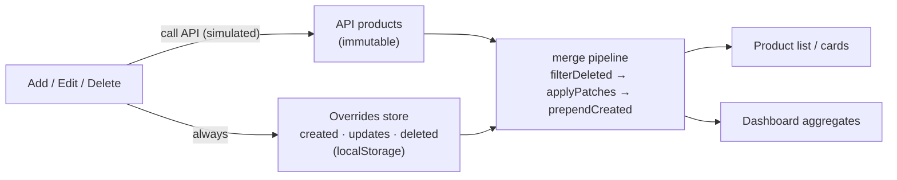

### URL state machine

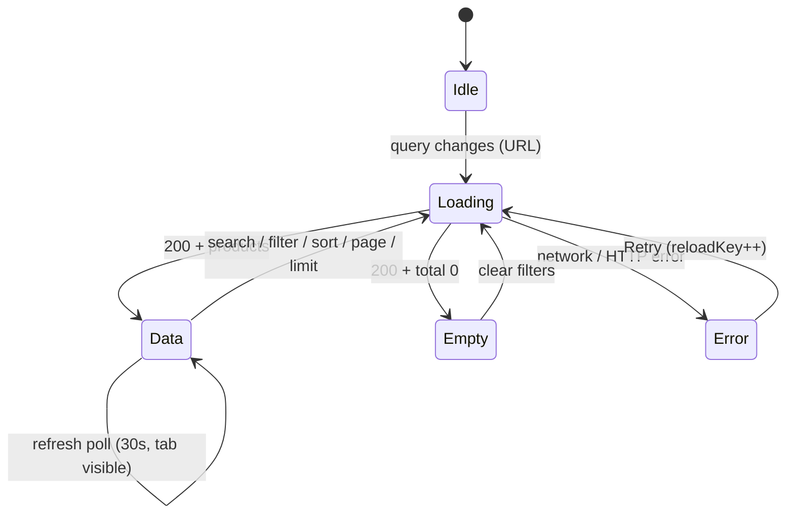

---

## Request lifecycle & edge cases

| Scenario | Handling | Location |
| --- | --- | --- |
| Fast typing / slow API | Debounce + `AbortController` + request-id | `useProducts.ts` |
| `?page=abc` | Falls back to page 1 | `parseListQuery` |
| `?page=999999` | Clamped to last real page once total is known | `ProductsBrowser` effect |
| `?limit=-10` / `?limit=abc` | Falls back to 10 | `parsePageSize` |
| Invalid `?sortBy=` | Ignored (no sort) | `parseListQuery` |
| Invalid `?category=` | API returns 0 results → empty state (no crash) | `ProductsBrowser` |
| Search + category together | Search wins; the other is cleared | `parseListQuery` + handlers |
| API failure | `ErrorState` + Retry button | `ErrorState.tsx` |
| Empty result | Intentional `EmptyState` + Clear filters | `EmptyState.tsx` |
| 404 product id | `NotFoundState` | `ProductDetail.tsx` |
| 401 (expired token) | Session cleared + redirect to `/login` | `client.ts` |
| Rapid Save / Login | In-flight ref guards | forms + login |
| Delete last item on a page | Pagination clamps to a valid page | `ProductsBrowser` |

---

## State management

No global state library. State is split by ownership:

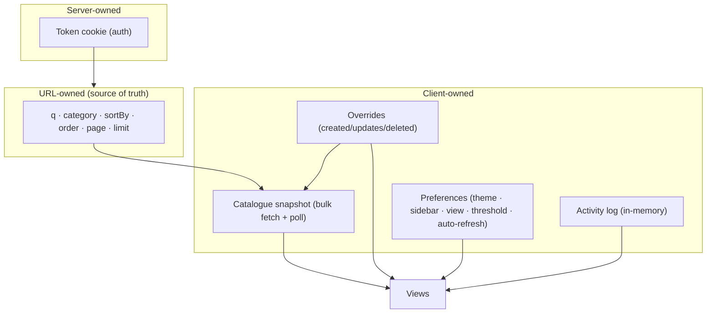

| State | Mechanism | Persistence |
| --- | --- | --- |
| List query (q/category/sort/page/limit) | URL search params + `router.replace` | URL (shareable/refresh-safe) |
| Session token | Cookie `ng_token` (+ user in localStorage) | 24h |
| Local mutations | `ProductOverridesContext` (useReducer) | localStorage |
| Catalogue analytics | `useCatalogSnapshot` (bulk fetch + 30s poll) | memory |
| Preferences | `usePersistedBoolean/Number/String` (`useSyncExternalStore`) | localStorage |
| Activity feed | module store + `useSyncExternalStore` | memory |
| Theme | `data-theme` attribute + inline init script | localStorage |

External stores use **`useSyncExternalStore`** so they are SSR-safe and never
cause hydration mismatches or `setState`-in-effect violations.

---

## Routing & route protection

### Routes

| Route | Type | Purpose |
| --- | --- | --- |
| `/login` | Static | Two-panel sign-in |
| `/` | Static | Dashboard (KPIs, charts, recent products/activity) |
| `/products` | Static | Product list (search/filter/sort/pagination) |
| `/products/new` | Static | Add product form |
| `/products/[id]` | Dynamic | Product details (gallery, tabs, reviews) |
| `/products/[id]/edit` | Dynamic | Edit product form |
| `/categories` | Static | Category analytics |
| `/analytics` | Static | Full analytics workspace |
| `/settings` | Static | Preferences + data controls |
| `/profile` | Static | Account details |
| `/_not-found` | Static | 404 |

### Guard

Route protection runs on the server in `src/proxy.ts` (Next.js 16 renamed
`middleware` → `proxy`). Unauthenticated requests to any non-public route are
redirected to `/login`; authenticated users hitting `/login` are redirected to
`/products`.

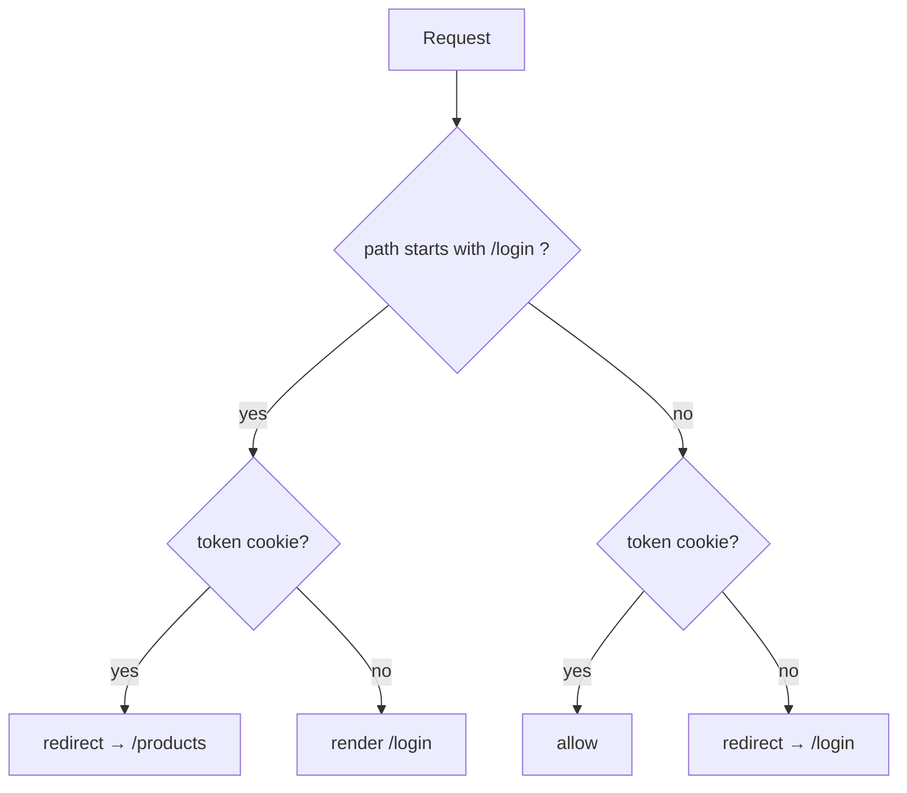

The token is a JS-readable cookie so the server proxy can see it (an `httpOnly`
cookie would require a server route — noted as a trade-off).

---

## API integration

Single Axios instance in `src/lib/api/client.ts`:

- `baseURL` from `NEXT_PUBLIC_API_BASE_URL` (fallback `https://dummyjson.com`)
- 20s timeout
- **Request interceptor** — attaches `Authorization: Bearer <token>`
- **Response interceptor** — normalises errors into a single `ApiError` type and
  handles `401` by clearing the session and redirecting
- Canceled requests are passed through untouched so hooks can ignore them

| Function | Method & endpoint | Used by |
| --- | --- | --- |
| `login()` | `POST /auth/login` | Login page |
| `fetchCurrentUser()` | `GET /auth/me` | Profile |
| `fetchProducts()` | `GET /products` · `/products/search` · `/products/category/{slug}` | Product list |
| `fetchProductById()` | `GET /products/{id}` | Details / edit |
| `fetchCategories()` | `GET /products/categories` | Filters / categories |
| `createProduct()` | `POST /products/add` | Add form |
| `updateProduct()` | `PUT /products/{id}` | Edit form |
| `deleteProduct()` | `DELETE /products/{id}` | Delete |
| `fetchCatalogSnapshot()` | `GET /products?limit=0&select=…` + categories | Dashboard analytics |

> DummyJSON write endpoints return a plausible object but do **not** persist it.
> The app still calls them, then mirrors the change locally.

---

## URL contract

```
/products?q=&category=&sortBy=title|price|rating&order=asc|desc&page=1&limit=10
```

The URL is the single source of truth for the list, so refresh, back/forward and
link-sharing all reproduce the same view.

| Param | Values | Default | Notes |
| --- | --- | --- | --- |
| `q` | string | — | Search term (search wins over category) |
| `category` | slug | — | Ignored while `q` is present |
| `sortBy` | `title` \| `price` \| `rating` | — | Invalid → no sort |
| `order` | `asc` \| `desc` | `asc` | Only applied with `sortBy` |
| `page` | integer ≥ 1 | `1` | Clamped to last real page |
| `limit` | `10` \| `20` \| `50` | `10` | Invalid → 10 |

Defaults are omitted from the URL to keep links clean.

---

## Design system

A token-based system in `src/app/globals.css` — a single `data-theme` attribute
switches every colour.

### Colour tokens

| Token | Dark | Light | Use |
| --- | --- | --- | --- |
| `--canvas` | `#070A08` | `#EEF2EE` | Page background |
| `--surface` | `#101713` | `#FFFFFF` | Raised surface |
| `--fg` | `#F0FDF4` | `#0C1511` | Primary text |
| `--fg-2` | `#A7B8AD` | `#46524B` | Secondary text |
| `--fg-3` | `#64746A` | `#6B776F` | Muted text |
| `--fg-4` | `#3F4A43` | `#9AA79F` | Disabled / faint |
| `--brand` | `#22C55E` | `#16A34A` | Primary accent (emerald) |
| `--brand-bright` | `#4ADE80` | `#22C55E` | Hover accent |
| `--warn` | `#FBBF24` | `#B45309` | Warnings / low stock |
| `--danger` | `#FB7185` | `#E11D48` | Destructive |
| `--info` | `#60A5FA` | `#2563EB` | Informational |

### Glass elevation levels

| Class | Purpose |
| --- | --- |
| `glass` | Default panels and cards |
| `glass-2` | Inset/secondary surfaces |
| `glass-strong` | Sidebar, topbar, bottom nav |
| `glass-float` | Dropdowns and modals |

### Other tokens

- **Radius:** cards 18px, panels 20px, buttons/inputs 12px, badges 11px; pills
  only for status badges and chips.
- **Typography:** Inter (via `next/font`); page title 20–24px, section 14–16px,
  body 13–14px, metadata 10–12px.
- **Motion:** 150–220ms transitions, `rise`/`pop` entrances, full
  `prefers-reduced-motion` support.

### Themes

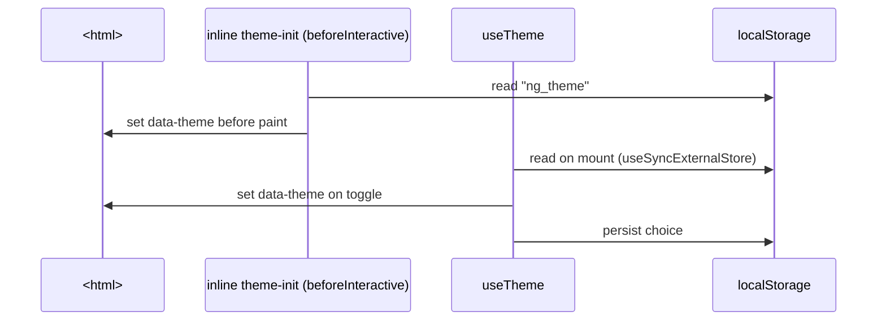

---

## Responsive UI

| Breakpoint | Layout |
| --- | --- |
| **< 768px (mobile)** | Bottom tab bar (Home · Products · Analytics · More), slide-in drawer, cards instead of table, horizontally scrollable filter chips, stacked KPIs |
| **768–1023px (tablet)** | Sidebar visible, 2-column KPI/grid, table with horizontal scroll when needed |
| **1024px+ (laptop)** | Full sidebar + topbar, 3-column grids |
| **1440px+ (desktop)** | Max-width 1440px content, 3–5 column analytics grid |

### Desktop dashboard wireframe

```
┌──────────┬───────────────────────────────────────────────────────────────┐
│ StoreFlow│  StoreFlow / Dashboard          ⌕ search      ☀  🔔  ◯ KD        │
│          ├───────────────────────────────────────────────────────────────┤
│ Dashboard│  Good afternoon, Karan             [Auto on] [Refresh]         │
│ Products │  ┌────────┐┌────────┐┌────────┐┌────────┐                     │
│ Categories│ │Products││ Rating ││Inventry││LowStock│  4 compact KPIs     │
│ Analytics │ └────────┘└────────┘└────────┘└────────┘                     │
│ Settings │  ┌───────────────────────────┐┌───────────────┐               │
│          │  │ Catalogue distribution ▁▂▅█ ││ Category donut │              │
│ ──────── │  ├───────────────────────────┤├───────────────┤               │
│ ◯ Karan  │  │ Recent Products   View all ││ Recent Activity│              │
│   Admin  │  └───────────────────────────┘└───────────────┘               │
│ ↪ Logout │                                                               │
└──────────┴───────────────────────────────────────────────────────────────┘
```

### Mobile products wireframe

```
┌──────────────────────────┐
│ ◉ StoreFlow        ⌕  🔔 │
├──────────────────────────┤
│ ⌕ Search products...     │
│ [All ▾] [Sort ▾] [10 ▾]  │
│ [Electronics][Price ↑]…  │
│ ┌──────────────────────┐ │
│ │ [image]              │ │
│ │ iPhone 15         ⋯  │ │
│ │ Smartphones          │ │
│ │ ₹799      ★ 4.8      │ │
│ │ Stock: 34  ● In Stock│ │
│ └──────────────────────┘ │
│  Showing 1–10 of 194     │
│  ‹ 1 2 3 … ›             │
├──────────────────────────┤
│ Home Products Analytics …│
└──────────────────────────┘
```

---

## Project structure

```
.
├── src/
│   ├── app/
│   │   ├── (dashboard)/            # shell-wrapped authenticated app
│   │   │   ├── layout.tsx          # providers + DashboardShell
│   │   │   ├── page.tsx            # dashboard
│   │   │   ├── products/           # list, new, [id], [id]/edit
│   │   │   ├── categories/
│   │   │   ├── analytics/
│   │   │   ├── settings/
│   │   │   └── profile/
│   │   ├── login/                  # two-panel sign-in
│   │   ├── layout.tsx              # Inter font + ambient background
│   │   ├── globals.css             # design tokens + glass utilities
│   │   └── not-found.tsx
│   ├── components/
│   │   ├── shell/                  # Sidebar, Topbar, BottomNav, drawer, search, menus, icons
│   │   ├── dashboard/              # GreetingHeader, KPIGrid, MetricCard, RecentProducts/Activity
│   │   │   └── charts/             # AreaChart, CategoryDonut, MiniSparkline, RatingHistogram…
│   │   ├── products/               # ProductsBrowser, Toolbar, Table, Card, RowMenu, Form, Detail
│   │   └── ui/                     # GlassCard, Skeleton, Badge, ConfirmDialog, states
│   ├── hooks/                      # useProducts, useProduct, useDebounce, useCatalogSnapshot…
│   ├── lib/
│   │   ├── api/                    # client.ts (axios), auth.ts, products.ts
│   │   ├── auth.ts                 # cookie/session helpers
│   │   ├── credentials.ts          # admin identity + login mapping
│   │   ├── stats.ts                # pure catalogue aggregations
│   │   ├── search-params.ts        # safe URL parsing/building
│   │   ├── overrides.ts            # local mutation merge logic
│   │   ├── activity.ts, system.ts  # activity log + connection/latency
│   │   ├── taxonomy.ts             # category family grouping
│   │   ├── format.ts, palette.ts   # formatting + chart palette
│   │   └── constants.ts
│   ├── store/                      # ProductOverridesContext, DashboardDataContext
│   ├── types/                      # shared TypeScript types
│   └── proxy.ts                    # route protection (Next 16)
├── next.config.ts
├── vercel.json
├── .env.example
└── package.json
```

---

## How it was built — step by step

The project was built incrementally with a commit per logical change (no single
big commit). Stages:

```mermaid
flowchart LR
  A["1. Scaffold<br/>Next 16 + TS + Tailwind + Axios"] --> B["2. Shared Axios<br/>+ API modules"]
  B --> C["3. Auth<br/>login · proxy guard · logout"]
  C --> D["4. Products<br/>URL state · list · pagination"]
  D --> E["5. Search<br/>debounce + abort/race guard"]
  E --> F["6. Details + CRUD<br/>forms · validation · delete modal"]
  F --> G["7. Dashboard<br/>KPIs · charts · activity"]
  G --> H["8. StoreFlow redesign<br/>dark emerald + light/dark theme"]
  H --> I["9. QA hardening<br/>dead code · duplicate guards"]
```

| Phase | What happened | Key commits |
| --- | --- | --- |
| **1. Scaffold** | Next.js 16 (App Router) + TypeScript + Tailwind v4 + Axios; base layout and tokens | `chore: scaffold…` |
| **2. Data layer** | Types, constants, URL helpers, shared Axios with interceptors, auth + products API modules | `feat(lib)…`, `feat(api)…` |
| **3. Auth** | Login page, token cookie, `proxy` route guard, logout | `feat(auth)…`, `feat(api)…` |
| **4. Products** | URL-driven list, pagination, sort, category filter, mobile cards | `feat(products)…` |
| **5. Search** | Debounced search with `AbortController` + request-id stale guard | `feat(products)…`, `fix(products)…` |
| **6. Details & CRUD** | Detail view, add/edit forms with validation, confirm-delete | `feat(products)…` |
| **7. Dashboard** | Bulk snapshot hook, KPIs, SVG charts, activity, status | `feat(dashboard)…` |
| **8. Redesign + theme** | Full dark/emerald design system, App Shell, Analytics/Settings pages, light/dark toggle | `feat(theme)…`, `feat(shell)…`, `feat(dashboard)…`, `feat(analytics,settings)…` |
| **9. QA** | Login duplicate guard, dead-code removal, `typecheck` script, docs | `fix(qa)…`, `docs…` |

Each phase was verified with `npm run lint`, `npm run typecheck`, `npm run build`,
and a production smoke test (route guard + invalid URL handling).

---

## Decisions & trade-offs

### Search vs category cannot be combined

DummyJSON has no endpoint that searches **and** filters by category at once
(`/products/search` ignores `category`; `/products/category/{slug}` has no `q`).
**Search wins** — starting a search clears the category filter and vice versa.
Search is the more explicit action, and client-side category filtering would break
correct server pagination totals.

### Add / edit / delete are simulated locally

The write endpoints return a plausible object but persist nothing. The app still
calls them, then mirrors each change in a `localStorage`-backed overrides store
that is merged over API data (and reflected in the dashboard). Settings can clear
these changes; the UI states they are browser-only.

### Real, honest metrics (no fabricated trends)

The API has no history, so the dashboard never invents it. KPIs are computed from
the live catalogue; the trend chips compare against the **session baseline**
(real, and it moves when you add/edit/delete); "live" signals are genuinely live
(measured latency, connection state, polling, activity log).

### Admin credentials

DummyJSON only validates its own demo accounts. The app accepts the admin
credentials locally and exchanges them for the demo account under the hood to
obtain a real token, then displays the admin identity. This is a
presentation/demo mapping, not a change to the API's authentication.

### Token in a JS-readable cookie

The token is stored in a JS-readable cookie so the server `proxy` can gate routes
without a server auth route. A production app would prefer an `httpOnly` cookie
set by a server endpoint; this is documented as a deliberate simplification.

---

## Performance

- **No heavy dependencies** — no chart/table/query libraries.
- **One bulk fetch** (≈86 KB) powers all analytics; the list stays paginated.
- **Debounce + abort** avoids redundant search requests.
- **`useSyncExternalStore`** for external state — no redundant re-renders.
- **`LazyMount`** defers below-the-fold dashboard sections via `IntersectionObserver`.
- **Polling pauses** when the tab is hidden.
- **Memoised aggregations** (`useMemo`) computed once per snapshot.
- Plain `` with a data-URI fallback.

---

## Accessibility

- Semantic landmarks (`header`, `nav`, `main`), labelled form fields.
- Buttons and icon-only controls carry `aria-label`; menus use `role="menu"`.
- Dialog uses `role="dialog"` + `aria-modal` and closes on `Escape`.
- Visible emerald focus ring (`focus-brand`) on interactive elements.
- Status is conveyed with text + shape, not colour alone.
- `RatingStars` exposes an `aria-label`; decorative images use `alt=""`.
- `prefers-reduced-motion` disables animations.

---

## Security notes

- No secrets in the repo — only `.env.example` is committed; `.env*` is ignored.
- No API key required (DummyJSON is public).
- No `console.*` logging and no `dangerouslySetInnerHTML` of user data.
- The only client-side "secret" is the demo admin password, which is inherently
  visible in a client-gated demo (documented).
- Mutation inputs are validated and rendered as text (no raw HTML injection).

---

## Verification & testing

| Check | Command / method |
| --- | --- |
| Lint | `npm run lint` |
| Types | `npm run typecheck` |
| Production build | `npm run build` |
| Route guard | `curl` without cookie → `307` to `/login` |
| Invalid URL params | `?page=abc&limit=-10&sortBy=bogus&category=nope` → 200, normalised |
| Race condition | `useProducts` abort + request-id (reasoned + API `&delay=2000`) |
| Live smoke test | Every route returns 200/307 as expected on Vercel |

There is no automated test suite; verification is lint + typecheck + build +
targeted production smoke tests.

---

## Deployment

Deployed to **Vercel** with `vercel.json` (`"framework": "nextjs"`).

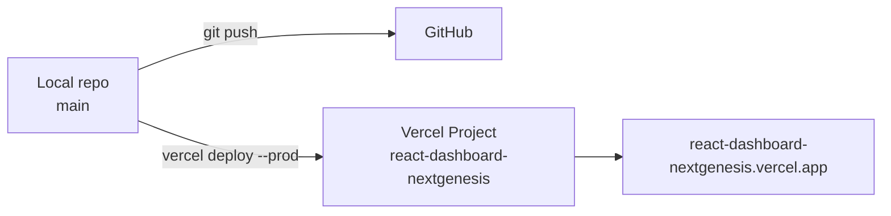

- Live: https://react-dashboard-nextgenesis.vercel.app
- No build-time env vars required.
- `NEXT_PUBLIC_API_BASE_URL` is optional.

---

## Troubleshooting

| Symptom | Cause / fix |
| --- | --- |
| Redirected to `/login` unexpectedly | Token cookie expired/cleared — sign in again |
| Products can't load | Check network; the API error state offers **Retry** |
| Add/edit "don't save" after reload | Expected — DummyJSON does not persist writes |
| Prices look large | INR display uses a fixed demo rate (1 $ ≈ ₹84) |
| Old user name shown | Hard refresh (`Ctrl+Shift+R`) to drop a cached bundle |

---

## Known limitations

- Mutations are per-browser (localStorage) and are not saved on DummyJSON.
- "Real-time" is polling (30s), not push — the API has no websocket/SSE.
- Prices are a fixed-rate INR demonstration of the API's USD values.
- The demo admin credential is visible in the client bundle (client-side gate).
- No automated test suite.

---

## Credits

- Product data & auth by [DummyJSON](https://dummyjson.com).
- Icons hand-drawn inline (Lucide-style), charts hand-built SVG/CSS.
- Built by **Karan Darade**.
